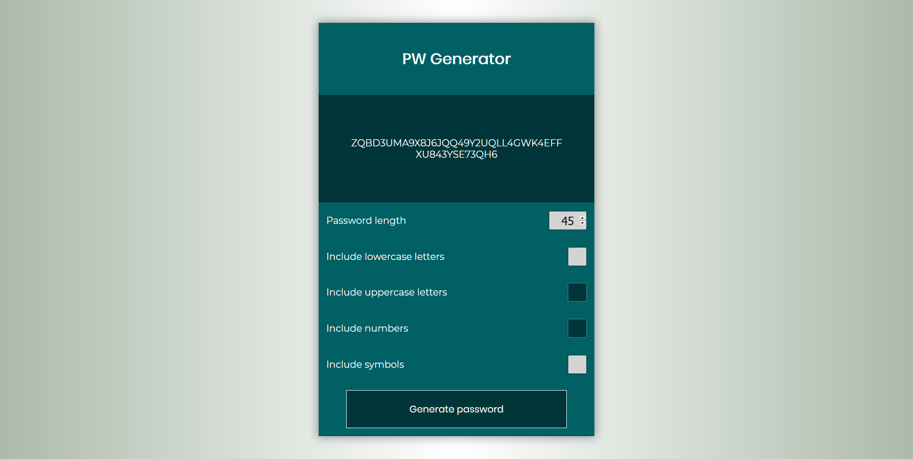

# PW Generator

> Password generator app made in JS.

## Table of contents

- [General info](#general-info)
- [Screenshots](#screenshot)
- [Technologies](#technologies)
- [Setup](#setup)
- [Status](#status)

## General info

This project was made to practice JS.

I had a lot of fun making this project because every time that I thought I had finished something else broke.

Some of the things that I have learned with this project are how to use **addEventListener** to target certain events and add/remove classes with **classList**.

## Screenshot

## Technologies

- HTML
- CSS
- JS

## Setup

- [Demo](https://romantic-keller-56a8f3.netlify.app/)

## Status

Project is: _finished_
